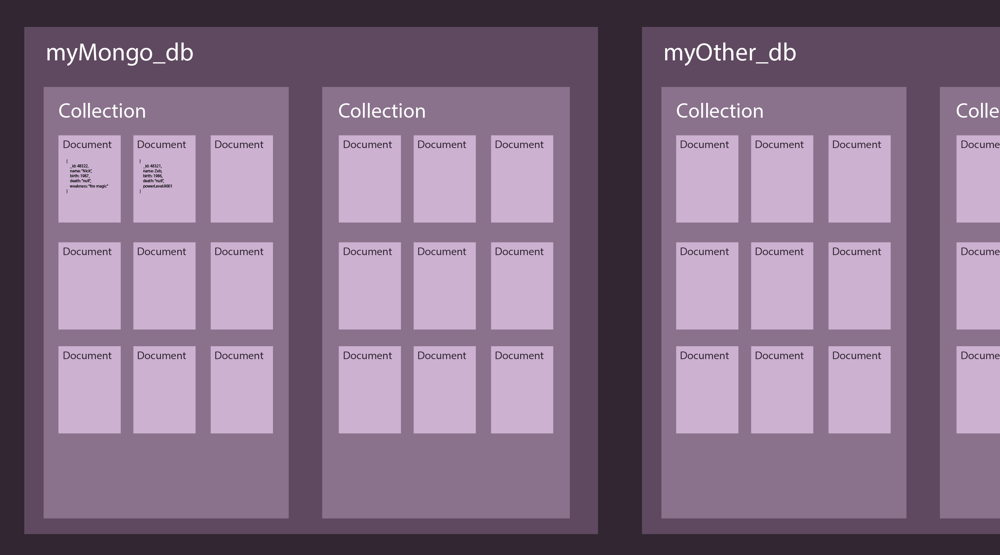

<!--
Created By: Alex White
Market: SF
Adapted By: Zeb Girouard
Market: DEN
-->

<!--Would be ideal to finish at 10:50, but a lot of these sections are like 3,4 minutes (not 5) so blocks go to 10:55-->


<!--9:35 10 minutes -->

<!--Hook: So let's think back to OMDB and all those movies we had to parse.  How many did we get back?  So we only had to grab that data a few times to test.  What would happen if we wanted to grab that data 4,000 times a day?  How would you feel if I asked you for your GitHub link to the homework 4,000 times a day?  Raise your hand if that would piss you off.  OK, so instead of that, maybe we could just ask once, save it, and then check it whenever we need it.  OK, so I don't check your HW 4,000 times a day, but websites can check things much more than that.  We've talked about localStorage as a way to save things locally, but if we go to a different browser or computer, we lose that, and I certainly don't want to store several hundred movies in my browser. This is where Databases come in.  And specifically, today we'll be looking at MongoDB. -->

# MongoDB

## Why is this important?
*This workshop is important because:*
- As of Dec 2017, MongoDB is the fifth most popular type of database management system, and the most popular for document stores.
- *aside*: [The top five](http://db-engines.com/en/ranking).
- MongoDB uses a JSON-like data structure (called BSON or Binary JSON) so it integrates easily into JavaScript Applications

## What are the objectives?
*After this workshop, developers will be able to:*
- **Set up** a local mongo db server
- **Perform** CRUD operations on documents using mongo CLI

## Where should we be now?
*Before this workshop, developers should already be able to:*
- **Run** Node in the console

<!--9:45 5 minutes -->

## Framing

[Mongo](https://www.mongodb.org) is an open-source document-based non-relational data store that provides:
- High Performance
- High Availability
- Automatic Scaling

> Later in the course we will learn about relational databases, which use join-tables & foreign keys to query our database in complex ways. NoSQL databases are an alternative that can be great for less complex databases. Because NoSQL databases are structured more simply, applications can read and write to them faster.

<!-- 9:50 10 minutes -->

## Documents

A MongoDB database consists of _documents_ (you can also refer to them as records):

- A `document` in MongoDB is composed of _field_ and _value_ pairs. Fields, aka keys, may store other documents, arrays, and arrays of documents as their values. It looks just like a JS or JSON object.
- A `collection` is just that - a collection of similar `documents`. For instance, a collection of cars, flowers, or users.
- The `database` is the highest structural element of a our MongoDB. It can hold as many collections as you'd like. Generally, you'll use one database per site, containing one or more collections of all your different types of data.


#### Data Format

Lets take a look of what a MongoDB _document_ may look like:

```js
{
    _id: ObjectId("5099803df3f4948bd2f98391"),
    name: { first: "Alan", last: "Turing" },
    birth: new Date('Jun 23, 1912'),
    death: new Date('Jun 07, 1954'),
    contributions: [ "Turing machine", "Turing test", "Turingery" ],
    views: 1250000
}
```

<!-- CFU: [Stop-and-Jot] What does this data structure remind you of? JSON! -->

A MongoDB _document_ is very much like JSON, except it is stored in the database in a format known as _BSON_ (think - _Binary JSON_).

_BSON_ basically extends _JSON_ with additional data types, such as __ObjectID__ and __Date__ shown above.

#### The Document _id

The *_id* is a special field that represents the document's _primary key_ and will always be listed as the first field. It must be unique.

<!-- We can explicitly set the *_id* like this:

```js
{
  _id: 2,
  name: "Suzy"
}
```
or this...

```js
{
  _id: "ABC",
  name: "Suzy"
}
``` 
-->

We can explicitly set the *_id*, but it's generally considered bad practice.  It's more common to allow MongoDB to create one for us, using its _ObjectID_ data type.

#### Collections

MongoDB stores documents in collections.

- Collections are analogous to tables in relational databases, which are similar to spreadsheets.
- Mongo does **NOT** require its documents to have the same schema - each document can have varied keys.
- Documents stored in a collection must have a unique `_id` field that acts as a primary key.

<!-- In MongoDB, we often _embed_ related data in a single document, you'll see an example of this later. -->

<!-- 10:00 10 minute -->

## Installing, Creating a DB, and Inserting Documents

#### Installation

You may already have MongoDB installed on your system - lets check in terminal. Enter: `mongod` (note the lack of a "b" at the end").

If you receive an error, lets use _Homebrew_ to install MongoDB:

1. Update Homebrew's database (this might take a bit of time)<br>`brew update`
2. Then install MongoDB

 `brew install mongodb`

MongoDB by default will look for data in a folder named `/data/db`. We would have had to create this folder, but Homebrew did it for us (hopefully).

#### Start Your Engine

`mongod` is the name of the actual database engine process. The installation of MongoDB does not set mongoDB to start automatically. A common source of errors when starting to work with MongoDB is forgetting to start the database engine.

To start the database engine, type `mongod` in terminal.

Press `control-c` to stop the engine.

<!--9:51 actual -->

<!--Half-mast-->

#### Creating a Database and Inserting Documents

MongoDB installs with it's own CLI(Command Line Interface), a JavaScript-based shell that allows us to interact with MongoDB directly in our terminal.

Start the CLI by typing `mongo` in the terminal. If you got an error, make sure `mongod` is running in another terminal tab.

The mongo interface will load and change the prompt will change to `>`.

List the shell's commands available: `> help`

## Think-pair-share:
- What jumps out as important?
- Try it

## Helpful commands
- `show dbs`: show database names
- `use <db_name>`: set current database
- `show collections`:  show collections in current database
- `db.foo.find()`: list objects in collection foo

Also:

- `<tab>` key completion
- `<up-arrow>` and the `<down-arrow>` for history.

In the mongo CLI, we want to connect to create/connect to a database.

Let's work with the `restaurant_db` database:

```js
use restaurant_db
```

Verify:

```js
> db
restaurant_db
```

Now what happens when you type `show dbs`?

There's no restaurant DB listed! That's because **even though we're currently using it, our database doesn't truly exist until we add a document to it**. Mongo tends to work this way - by simply stating that something exists, it is created.


<!--10:10 10 minutes -->
## Create a record

### Insert

- use `insert()` to add documents to a collection

```js
db.restaurants.insert(
   {
      name: "Cookies Corner",
      address : {
         street : "1970 2nd St NW",
         zipcode : 20001,
      },
      yelp: "http://www.yelp.com/biz/cookies-corner-washington"
});
```

> The db is the database we're connected to. In this case, `restaurant_db`. `.restaurants` is then referring to a collection in our `restaurant_db`. We use the `.insert()` to add the document inside the parentheses.

### Show all
```js
> show collections
restaurants
system.indexes
```

```js
> db.restaurants.find()
```

You should see three fields we specified:
- name
- address
- yelp

As well as one we didn't:
- _id

Remember that Mongo adds an `_id` field to your document automatically if you don't specify one for it. If you're still mystified as to why or how, check out this documentation on [ObjectId](https://docs.mongodb.org/manual/reference/object-id/).

>Fun fact about collections - If you attempt to add documents to a collection that does not exist, MongoDB will create the collection for you.


<!--WOAH all of a sudden just TONS of questions.  We were ahead of time, and now we're slightly behind schedule. 10:18 -->

<!--End half-mast -->

>Challenge:
Create your own restaurants DB and insert your favorite restaurant into it.  Make sure you can see the new restaurant and the DB in your mongo console.

<!-- 10:20 10 minutes -->

### Exercise: Add a few more restaurants.

ProTip: I recommend you construct your statements in your editor.  It will help you now (with syntax highlighting/indenting) and later (you will need to write statementes in JS in future labs). Can you insert multiple restaurants at one time?

#### Re-cap

Where are we now?

```
db
```

What step are we on?

1. Create DB
2. Use the appropriate DB
3. **Insert multiple restaurants**

<!--10:40 really -->

<details><summary>An Example</summary>

```js
db.restaurants.remove({});
db.restaurants.insert([
  {
      name: "Cookies Corner",
      address: {
         street: "1970 2nd St NW",
         zipcode: 20001,
      },
      yelp: "http://www.yelp.com/biz/cookies-corner-washington"
  },
  { name: "The Blind Dog Cafe", address: { street: "944 Florida Ave",
        zipcode: 20001 }, yelp: "http://www.yelp.com/biz/the-blind-dog-cafe-washington-2?osq=cookies" },
  {name: "Birch & Barley", address: { street: "1337 14th St NW", zipcode: 20005}, yelp: "http://www.yelp.com/biz/birch-and-barley-washington?osq=Restaurants+cookies"},
  {name: "Captain Cookie and the Milk Man", address: { street: "Dupont Circle", zipcode: 20036 }, yelp: "http://www.yelp.com/biz/captain-cookie-and-the-milk-man-washington-5" },
  {name: "J’s Cookies", address: { street: "1700 N Moore St", zipcode: 22209}, yelp: "http://www.yelp.com/biz/js-cookies-arlington" }
])
db.restaurants.count()
```

</details>

<!-- 10:30 5 minutes -->

### Find by Conditions

`Key: Value` Pairs

```js
db.restaurants.find({name: "Cookies Corner"});
db.restaurants.find({"address.zipcode": 20001});
```

>Note: that we can search for nested data, such as the `address.zipcode` by using a string as the key.

>Challenge:
Search for matching restaurants by *all* the properties in your restaurant documents.

<!-- 10:35 5 minutes -->

### Update a document:

[Update](http://docs.mongodb.org/manual/core/write-operations-introduction/) a restaurant to have a new key-value par `{state: "DC"}`

```js
db.restaurants.update(
  {name: "Cookies Corner"},
  { $set: { state: "DC" }}
)
```

> Note: the first key value pair finds the document you'd like to update, the second is what values you'd like to set and third is any additional options

Verify:

```js
db.restaurants.find()
```

>Challenge:
Update one of your restaurants and verify it has changed in the mongo console.

<!--10:40 5 minutes -->

### Delete a document

```js
db.restaurants.remove({ name: "Cookies Corner" })
```

> Note: this will remove all restaurants with the name `"Cookies Corner"`

>Challenge:
Delete one of your restaurants and verify it has been removed in the mongo console.

<!-- 10:45 5 minutes -->

## Dropping a Database

```
use milk-n-cookies
db.dropDatabase()
```

Drops the **current** database.

>Challenge:
Drop your restaurants DB.  Make sure you can't see it anymore in the mongo console.

<!-- 10:50 5 minutes -->

## Closing Thoughts
- MongoDB is a popular open-source NoSQL database system. It includes the following components:
  1. mongod - The database process.
  3. mongo  - The database shell (uses interactive javascript).

## Additional Resources
- [CRUD Intro](http://docs.mongodb.org/manual/core/crud-introduction/)
- [CRUD Commands](http://docs.mongodb.org/manual/reference/crud/)
- [MongoDB's GitHub](https://github.com/mongodb/mongo)

## Licensing
All content is licensed under a CC­BY­NC­SA 4.0 license.
All software code is licensed under GNU GPLv3. For commercial use or alternative licensing, please contact legal@ga.co.
